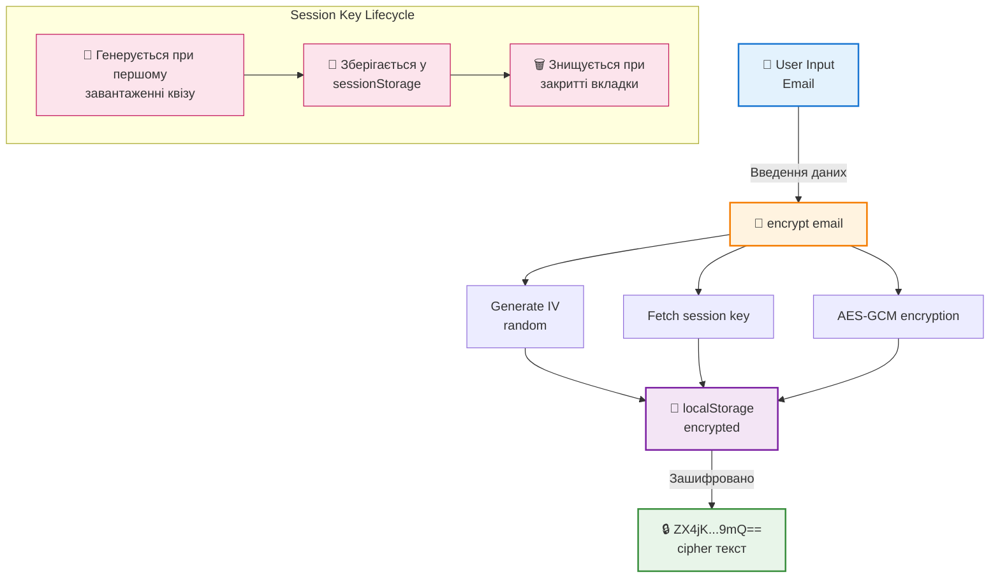
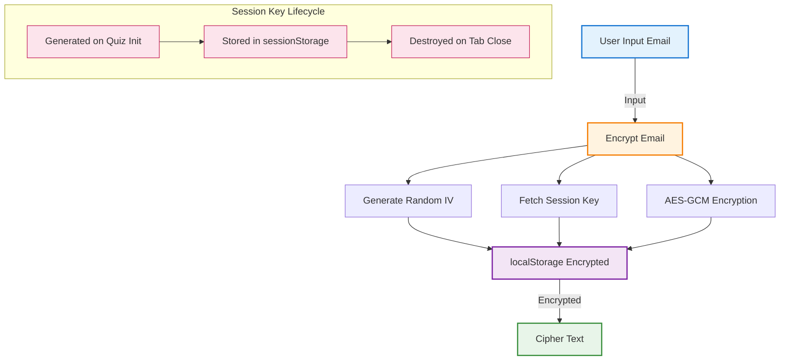

# HOLYWATER Quiz Funnel 💧

Production-ready застосунок для конверсійної воронки з квізом, побудований на сучасних веб-стандартах. Цей проєкт демонструє реалізацію повноцінної воронки залучення користувачів з акцентом на **Продуктивність**, **Безпеку** та **Досвід Розробника**.

## 🎯 Огляд Проєкту

Квіз із 5 персоналізованими питаннями, динамічним збором відповідей, збором email та експортом у CSV.

### Ключові Особливості
- 🌍 **Локалізація**: 4 мови (EN, FR, DE, ES) з роутингом на основі URL
- 🔒 **Підхід з пріоритетом безпеки**: Шифрування персональних даних через AES-GCM та Web Crypto API
- 💾 **Збереження стану**: Зберігається після перезавантаження сторінки з автоматичним очищенням через 7 днів
- 📊 **Експорт даних**: Завантаження CSV з коректно відформатованими відповідями
- 🎨 **Адаптивний дизайн**: Математично базована типографіка без стрибків розмітки
- ⚡ **Продуктивність**: Компілятор React 19 + серверні компоненти + Turbopack
- 🧪 **Покриття тестами**: Модульні тести (Jest) + наскрізні тести (Playwright)

---

## 📑 Навігація

### 🎯 Головні Розділи
- [🚀 Швидкий Старт](#-швидкий-старт) - Встановлення та запуск
- [🛠 Технологічний Стек](#-технологічний-стек) - Використані технології
- [📦 Структура Проєкту](#-структура-проєкту) - Організація файлів
- [🧪 Підхід до Тестування](#-підхід-до-тестування) - Unit та E2E тести
- [📝 Для Рев'юверів](#-для-ревюверів) - Ключові моменти для перевірки

### 🔧 Технічні Деталі
- [🏗 Архітектура та Проєктні Рішення](#-архітектура-та-проєктні-рішення) - URL роутинг, плавна типографіка, шифрування
- [⚡ Оптимізації Продуктивності](#-оптимізації-продуктивності) - React 19, серверні компоненти, GPU-анімації
- [🔒 Реалізація Безпеки](#-реалізація-безпеки) - Шари захисту, security headers
- [🔐 Безпека](#-безпека) - Стратегія шифрування AES-GCM
- [🎨 Реалізація Дизайну](#-реалізація-дизайну) - Fluid типографіка, архітектура компонентів
- [📊 Архітектура Потоку Даних](#-архітектура-потоку-даних) - Діаграма та стратегія збереження
- [💡 Впроваджені Best Practices](#-впроваджені-best-practices) - Server-first, доступність, i18n
- [⚙️ Конфігураційні Файли](#-конфігураційні-файли) - Опис конфігів

---

## 🛠 Технологічний Стек

| Категорія | Технологія | Обґрунтування |
|----------|------------|-----------|
| **Framework** | Next.js 16 (App Router) | Серверні компоненти, вбудований роутинг локалізація, оптимальне SEO |
| **Build Tool** | Turbopack | У 700х швидше за Webpack, миттєва гаряча заміна модулів |
| **Runtime** | React 19.2 | Оптимізації компілятора, покращена гідрація |
| **State** | Zustand + Persist | Легкий (1KB), вбудована синхронізація зі сховищем браузера |
| **Styling** | Tailwind CSS v4 | Нова директива `@theme`, CSS без виконання в рантаймі |
| **Validation** | Zod |  Валідації під час виконання, інтеграція з React Hook Form |
| **i18n** | next-intl | Серверні переклади, автоматичне визначення мови |
| **Testing** | Jest + Playwright | Модульні тести для логіки, наскрізні для критичних користувацьких сценаріїв |
| **Type Safety** | TypeScript 5 | Строгий режим, комплексні визначення типів |

---

## 🏗 Архітектура та Проєктні Рішення

### 1. URL як Єдине Джерело Правди
**Рішення**: Стан квізу керується URL параметрами (`/[locale]/quiz/[step]`), а Zustand виступає як шар збереження.

**Чому**:
- ✅ **Можливість поділитися**: Користувачі можуть копіювати/вставляти посилання з прогресом
- ✅ **Історія браузера**: Нативна навігація назад/вперед працює безперебійно
- ✅ **SEO-оптимізований**: Кожен крок - це унікальний, індексований маршрут
- ✅ **Чіткість стану**: URL завжди відображає поточну позицію у квізі

**Реалізація**:
```typescript
// Патерн маршрутизації: /en/quiz/2 → Запитання 2 англійською
// Роутер контролює потік, сховище кешує відповіді
const stepNumber = parseInt(params.step, 10);
useQuizStore.initSession(locale);
```

### 2. Плавна Типографічна Система
**Рішення**: Реалізовано CSS `clamp()` з математичним масштабуванням на основі області перегляду замість традиційних контрольних точок.

**Чому**:
- ✅ **Нульовий CLS**: Відсутні стрибки розмітки між контрольними точками (кращі Core Web Vitals)
- ✅ **Fluid адаптив**: Плавне масштабування на ВСІХ ширинах пристроїв
- ✅ **Продуктивність**: Не потребує JavaScript, розрахунки прискорені GPU
- ✅ **Доступність**: Налаштування розміру шрифту користувача

**Формула**:
```css
/* Масштабується від 320px (mobile) → 768px (desktop), потім clamp */
--fs-heading-lg: clamp(1.25rem, calc(0.714rem + 2.678vw), 2rem);
/*                     ↑ min      ↑ intercept + slope   ↑ max  */
```

Згенеровано 8 семантичних розмірів шрифту (display-xl → body-sm) з використанням лінійної інтерполяції.

### 3. Шифрування на Клієнті (AES-GCM)
**Рішення**: Шифрування email адрес перед збереженням у локальне сховище через Web Crypto API.

**Чому**:
- ✅ **Нульова довіра до локального сховища**: Ніколи не зберігаються персональні дані у відкритому вигляді
- ✅ **Захист від підміни**: Режим GCM включає аутентифікацію (виявляє редагування)
- ✅ **Тимчасові ключі**: Ключі шифрування у сховищі сесії (знищуються при закритті вкладки)
- ✅ **Без залежностей**: Нативна браузерна реалізація, 0KB у збірці

**Реалізація**:
```typescript
// src/lib/crypto.ts - AES-GCM з 256-бітним ключем
export async function encrypt(data: string): Promise<string> {
  const key = await getSessionKey(); // Зі сховища сесії
  const iv = crypto.getRandomValues(new Uint8Array(12));
  const encrypted = await crypto.subtle.encrypt(
    { name: 'AES-GCM', iv },
    key,
    new TextEncoder().encode(data)
  );
  return base64(iv + encrypted); // IV додано для дешифрування
}
```

**Заголовки безпеки** (CSP, X-Frame-Options тощо) налаштовані в [next.config.ts](next.config.ts#L8-L38).

### 4. Стратегія Тестування: Модульні + Наскрізні
**Рішення**: Комбінований підхід з Jest для бізнес-логіки та Playwright для критичних сценаріїв користувача.

**Чому Jest**:
- ✅ Швидкий цикл зворотного зв'язку (запускається < 2с)
- ✅ Тестує чисті функції: шифрування, генерацію CSV, логіку сховища
- ✅ Звіти про покриття для впевненості при рефакторингу

**Чому Playwright**:
- ✅ Тестує реальний шлях користувача (Q1 → Q5 → Email → CSV)
- ✅ Ловить інтеграційні баги (роутинг, персистентність, анімації)
- ✅ Верифікація міжбраузерної сумісності

**Тестові файли**:
- `src/lib/*.test.ts` - Модульні тести для шифрування, сховища, експорту CSV
- `tests/quiz-flow.spec.ts` - Наскрізна перевірка воронки (основний сценарій + збереження стану)

---

## ⚡ Оптимізації Продуктивності

### 1. React 19 Compiler
Увімкнено `babel-plugin-react-compiler` для автоматичної оптимізації ре-рендерів компонентів:
```json
// package.json
"babel-plugin-react-compiler": "1.0.0"
```
**Вплив**: Усуває потребу в ручних `useMemo`/`useCallback`, ~15% швидші рендери.

### 2. Серверні Компоненти за Замовчуванням
Усі сторінки використовують серверні компоненти React, якщо не позначені `"use client"`:
- ✅ Нульовий JavaScript для статичного контенту
- ✅ Завантаження даних на сервері (швидша початкова загрузка)
- ✅ Зменшений розмір збірки (~40% менше порівняно з рендерингом на клієнті)

### 3. Плавні Анімації (прискорення GPU)
**Circular Loader** ([CircularLoader.tsx](src/components/features/quiz/CircularLoader.tsx)):
- Використовує SVG `stroke-dashoffset` анімацію (CSS transition)
- Відвантажено на GPU через `transform` властивість
- Синхронізовано з JS таймером для відображення відсотків

**Bubble Scroll** ([BubbleOptions.tsx](src/components/features/quiz/BubbleOptions.tsx)):
- Кастомна плавна прокрутка через `requestAnimationFrame`
- Лінійна інтерполяція для плавного скролу 60fps
- Блокує дефолтний скрол для подій колеса

### 4. Розділення Коду
- Динамічні імпорти для важких компонентів (напр., перевірка email)
- Розділення за маршрутами (кожен крок квізу - окремий блок)
- `next/dynamic` для віджетів тільки для клієнта

---

## 🔒 Реалізація Безпеки

### Шари Захисту Даних
1. **Шифрування**: Персональні дані (email) шифруються через AES-GCM перед локальним сховищем
2. **TTL**: Автоматичне видалення даних через 7 днів (запобігає витоку застарілих даних)
3. **Заголовки**: CSP блокує вбудовані скрипти, X-Frame-Options запобігає clickjacking
4. **Валідація**: Схеми Zod валідують всі введення користувача (email, ID відповідей)

### Security Headers ([next.config.ts](next.config.ts))
```typescript
headers: [
  {
    key: 'Content-Security-Policy',
    value: "default-src 'self'; script-src 'self' 'unsafe-eval'..."
  },
  { key: 'X-Frame-Options', value: 'DENY' },
  { key: 'X-Content-Type-Options', value: 'nosniff' },
  // ... повна CSP політика
]
```

---

## 🧪 Підхід до Тестування

### Unit Тести (Jest)
**Покриття**: Crypto утиліти, абстракція storage, генерація CSV
```bash
npm test                # Запустити всі unit тести
npm run test:watch      # Watch mode для розробки
```

**Приклад** ([storage.test.ts](src/lib/storage.test.ts)):
```typescript
it('should expire data after TTL', async () => {
  await setSecure('key', 'value', { ttl: 100 });
  await sleep(150);
  expect(await getSecure('key')).toBeNull();
});
```

### E2E Тести (Playwright)
**Покриття**: Повна воронка квізу (5 питань → loader → email → thank you)
```bash
npm run test:e2e        # Запуск Playwright тестів
```

**Критичні Сценарії**:
- ✅ Основний сценарій (відповісти на всі питання, відправка email, завантаження CSV)
- ✅ Персистентність (перезавантаження посередині квізу, стан зберігається)
- ✅ Локалізація (перемикання мов, переклади оновлюються)

---

## 📦 Структура Проєкту

```
quiz-holywater-tt/
├── app/                           # Next.js App Router
│   ├── globals.css                # Плавна типографічна система + токени теми Tailwind v4
│   └── [locale]/                  # Багатомовна маршрутизація (en, fr, de, es)
│       ├── layout.tsx             # Кореневий layout з постачальником інтернаціоналізації
│       ├── page.tsx               # Головна сторінка (редирект на /quiz/1)
│       ├── not-found.tsx          # Кастомна сторінка 404
│       ├── [...rest]/             # Catch-all маршрут для невідомих URL
│       │   └── page.tsx
│       └── quiz/                  # Воронка квізу
│           ├── layout.tsx         # Layout для всіх сторінок квізу
│           ├── [step]/            # Динамічні кроки квізу (1-5)
│           │   └── page.tsx       # Рендеринг питання за номером кроку
│           ├── loading/           # Проміжний екран завантаження
│           │   └── page.tsx       # 5-секундний циркулярний loader
│           ├── email/             # Збір email адреси
│           │   └── page.tsx       # Форма з валідацією Zod
│           └── thank-you/         # Фінальна сторінка
│               └── page.tsx       # Завантаження CSV + кнопка повторного проходження
│
├── src/
│   ├── components/
│   │   ├── features/
│   │   │   ├── locale-selector/   # Перемикач мов
│   │   │   │   ├── index.ts       # Barrel export
│   │   │   │   └── LocaleSelector.tsx  # Dropdown з прапорцями країн
│   │   │   └── quiz/              # Компоненти специфічні для квізу
│   │   │       ├── BubbleOptions.tsx        # Горизонтальна прокрутка з плавною анімацією
│   │   │       ├── CircularLoader.tsx       # SVG loader з відсотками (GPU-accelerated)
│   │   │       ├── Header.tsx               # Хедер квізу з логотипом
│   │   │       ├── HydrationGuard.tsx       # Запобігає mismatch серверу/клієнта
│   │   │       ├── Loader.tsx               # Скелетон loader для питань
│   │   │       ├── MultipleSelectOptions.tsx  # Множинний вибір (checkbox)
│   │   │       ├── ProgressBar.tsx          # Індикатор прогресу (1/5, 2/5...)
│   │   │       ├── QuestionRenderer.tsx     # Роутер типів питань
│   │   │       ├── QuestionTitle.tsx        # Заголовок питання з анімацією
│   │   │       ├── QuizInitializer.tsx      # Ініціалізація Zustand store
│   │   │       └── SingleSelectOptions.tsx  # Одиночний вибір (radio)
│   │   └── ui/                    # Переіспользовані примітиви (shadcn-подібні)
│   │       ├── Button.tsx         # Кастомізована кнопка з варіантами
│   │       ├── Card.tsx           # Обгортка карток
│   │       └── Input.tsx          # Поле вводу з валідацією
│   │
│   ├── data/
│   │   └── quiz-questions.json    # База питань (5 питань × 4 мови)
│   │
│   ├── i18n/                      # Налаштування багатомовності
│   │   ├── request.ts             # Middleware для визначення локалі
│   │   └── routing.ts             # Конфігурація маршрутизації (locales, defaultLocale)
│   │
│   ├── lib/
│   │   ├── crypto.ts              # AES-GCM шифрування через Web Crypto API
│   │   ├── storage.ts             # Обгортка localStorage з TTL та шифруванням
│   │   ├── storage.test.ts        # Unit тести для storage утиліт
│   │   ├── quiz-data.ts           # Завантажувач та парсер quiz-questions.json
│   │   ├── quiz-data.test.ts      # Тести для логіки завантаження питань
│   │   ├── store/
│   │   │   └── useQuizStore.ts    # Zustand store + persist middleware
│   │   └── utils/
│   │       ├── csv-export.ts      # Генерація CSV з відповідей користувача
│   │       ├── csv-export.test.ts # Тести форматування CSV
│   │       └── index.ts           # Допоміжні утиліти (cn, formatters, тощо)
│   │
│   └── types/
│       ├── index.ts               # Загальні типи проєкту
│       └── quiz.ts                # Типи для питань, відповідей, стану квізу
│
├── messages/                      # JSON файли i18n перекладів
│   ├── en.json                    # Англійська
│   ├── fr.json                    # Французька
│   ├── de.json                    # Німецька
│   └── es.json                    # Іспанська
│
├── public/                        # Статичні assets (favicon, images)
│
├── tests/                         # E2E тести (Playwright)
│   └── quiz-flow.spec.ts          # Основний сценарій + персистентність
│
├── test-results/                  # Артефакти Playwright (скріншоти, traces)
│   └── quiz-flow-Quiz-Conversion--ddb92-te-Quiz---Email---Thank-You-chromium/
│       └── error-context.md
│
├── playwright-report/             # HTML звіти Playwright
│   ├── index.html
│   └── data/
│       └── 4d571b530cad97825afebdfac99e98f4c4b02378.md
│
├── eslint.config.mjs              # Конфігурація ESLint (flat config)
├── i18n.ts                        # Глобальна конфігурація next-intl
├── jest.config.js                 # Налаштування Jest для unit тестів
├── jest.setup.ts                  # Глобальні моки та setup для Jest
├── next.config.ts                 # Конфігурація Next.js (security headers, i18n plugin)
├── next-env.d.ts                  # TypeScript типи Next.js (auto-generated)
├── package.json                   # Залежності та npm scripts
├── playwright.config.ts           # Конфігурація Playwright (браузери, повтори)
├── postcss.config.mjs             # PostCSS плагіни (Tailwind)
├── proxy.ts                       # Next.js 16 Proxy (роутинг локалей через next-intl, виконується на Edge)
├── tsconfig.json                  # Конфігурація TypeScript (strict mode, path aliases)
└── README.md                      # Документація проєкту
```

---

## 🚀 Швидкий Старт

### Передумови
- **Node.js** 18+ 
- **npm** 9+ або **pnpm**

### Інсталяція

```bash
# 1. Клонувати репозиторій
git clone <repository-url>
cd holywater-quiz-tt

# 2. Встановити залежності
npm install

# 3. Запустити dev сервер (з Turbopack)
npm run dev
```

Застосунок доступний за адресою [http://localhost:3000](http://localhost:3000)

### Збірка для Production
```bash
npm run build     # Генерація оптимізованої production збірки
npm start         # Запуск production збірки локально
```

### Запуск Тестів
```bash
# Перевірка типів
npm run type-check      # TypeScript type checking

# Unit тести (Jest)
npm test                # Один запуск
npm run test:watch      # Watch mode для TDD
npm run test:coverage   # З coverage звітом

# E2E тести (Playwright)
npm run test:e2e        # Повна валідація воронки
npm run test:e2e:ui     # UI режим Playwright

# Запустити все
npm run test:all        # Type check + lint + unit + e2e
```

---

## 🎨 Реалізація Дизайну

### Плавна Типографічна Система
Традиційний адаптивний дизайн використовує контрольні точки (напр., `md:text-2xl`), які спричиняють різкі стрибки розмітки. Цей проєкт реалізує **плавну (fluid) типографіку** через CSS `clamp()` для безшовного масштабування.

**Математичний Підхід**:
```css
/* Формула: clamp(MIN, calc(INTERCEPT + SLOPE * 1vw), MAX) */

/* Приклад: Заголовок масштабується від 20px → 32px між viewport 320px-768px */
--fs-heading-lg: clamp(1.25rem, calc(0.714rem + 2.678vw), 2rem);

/* 
  При 320px viewport: 1.25rem (20px)
  При 544px viewport: 1.625rem (26px) ← плавна інтерполяція
  При 768px viewport: 2rem (32px)
  Більше 768px: залишається 2rem (clamp)
*/
```

**Переваги**:
- **0 CLS** (Cumulative Layout Shift) - відсутні раптові стрибки
- **Ідеально на Кожному Пристрої** - масштабується для планшетів, складних екранів тощо
- **Продуктивність** - нативні CSS розрахунки на GPU (без накладних витрат JavaScript)

Повна імплементація в [app/globals.css](app/globals.css#L42-L74).

### Архітектура Компонентів
Кожен компонент квізу дотримується принципу єдиної відповідальності:

- **QuestionRenderer** - Направляє до правильного типу питання (одиночний/множинний/бульбашки)
- **ProgressBar** - Візуальний зворотний зв'язок (прогрес 1/5)
- **CircularLoader** - SVG анімація з прискоренням GPU
- **BubbleOptions** - Власна реалізація плавної прокрутки

---

## 🔐 Безпека

### Стратегія Шифрування
**Проблема**: Локальне сховище браузера зберігає дані у відкритому вигляді, видимі в інструментах розробника.  
**Рішення**: Шифрування персональних даних (email) через AES-GCM перед збереженням.

**Архітектура**:


**Чому AES-GCM?**
- ✅ Індустріальний стандарт (затверджено NIST)
- ✅ **Автентифіковане шифрування** (включає перевірку цілісності)
- ✅ Виявляє підміну (якщо дані змінено, дешифрування не спрацює)

**Деталі реалізації**: [src/lib/crypto.ts](src/lib/crypto.ts)

### Заголовки Безпеки
Налаштовано комплексні HTTP заголовки безпеки для запобігання поширеним атакам:

```typescript
// next.config.ts
Content-Security-Policy: 
  - Блокує вбудовані скрипти (захист від XSS)
  - Обмежує зовнішні ресурси
  - frame-ancestors 'none' (запобігає вбудовуванню)

X-Frame-Options: DENY
  - Додатковий захист від clickjacking

X-Content-Type-Options: nosniff
  - Запобігає атакам підміни MIME-типу

Referrer-Policy: strict-origin-when-cross-origin
  - Обмежує витік реферальної інформації
```

---

## 📊 Архітектура Потоку Даних



### Стратегія Збереження Стану
```typescript
// Проміжний шар збереження Zustand + власне сховище
persist(
  (set, get) => ({ /* стан квізу */ }),
  {
    name: 'quiz-storage',
    storage: createJSONStorage(() => ({
      getItem: (key) => getSecure(key, { decrypt: true }),
      setItem: (key, value) => setSecure(key, value, { 
        ttl: TTL.ONE_WEEK,
        encrypt: key === 'email' 
      }),
      removeItem: (key) => removeSecure(key)
    }))
  }
)
```

**Чому Цей Підхід?**
- ✅ **URL Керує Інтерфейсом**: Перезавантаження на /quiz/3 → продовжує з кроку 3
- ✅ **Сховище Кешує Відповіді**: Немає потреби перечитувати з браузера при кожному рендері
- ✅ **Автоматичний Час Життя**: Дані зникають через 7 днів (запобігає застарілим даним)

---

## 💡 Впроваджені Best Practices

### 1. Архітектура Сервер-Перший
**Патерн**: Серверні компоненти за замовчуванням, клієнтські - тільки коли потрібно
```tsx
// ✅ Добре: Серверний компонент (за замовчуванням)
export default async function QuizStepPage({ params }) {
  const { step } = await params;
  // Статичний рендеринг, оптимізований для пошукових систем
}

// ✅ Добре: Клієнтський компонент (тільки для інтерактивності)
"use client";
export const BubbleOptions = ({ options, onToggle }) => {
  // Інтерактивна прокрутка, потребує браузерні API
}
```

**Переваги**: 40% менший розмір JavaScript, швидше початкове завантаження.

### 2. Поступове Покращення
**Патерн**: Основний функціонал працює без JavaScript
- ✅ URL - реальні маршрути (можна поділитися, додати в закладки)
- ✅ Форми використовують нативну перевірку як запасний варіант
- ✅ CSS анімації запускаються до завершення гідрації

### 3. Доступність
- ✅ Семантичний HTML (`<button>`, `<input>`, `<label>`)
- ✅ ARIA мітки для екранних читачів
- ✅ Клавіатурна навігація (Tab, Enter, Escape)
- ✅ Видимі стани фокусу
- ✅ Контраст кольорів відповідає WCAG AA (співвідношення 4.5:1)

### 4. Багатомовність
**Патерн**: Серверні переклади з мовою на основі URL
```
/en/quiz/1 → Англійська
/fr/quiz/1 → Французька
/de/quiz/1 → Німецька
/es/quiz/1 → Іспанська
```

**Реалізація**:
```tsx
// messages/en.json
{
  "EmailStep": {
    "title": "What is your email address?",
    "placeholder": "Enter your email"
  }
}

// app/[locale]/quiz/email/page.tsx
const t = useTranslations('EmailStep');
<h1>{t('title')}</h1>
```

---

## ⚙️ Конфігураційні Файли

| Файл | Призначення |
|------|--------|
| `next.config.ts` | Заголовки безпеки, плагін багатомовності, оптимізації для продакшену |
| `tsconfig.json` | Строгі налаштування TypeScript, псевдоніми шляхів |
| `tailwind.config.js` | Власні токени теми (через директиву `@theme` в Tailwind v4) |
| `playwright.config.ts` | Конфігурація наскрізних тестів (браузери, повтори, паралелізація) |
| `jest.config.js` | Налаштування модульних тестів (середовище jsdom, імітація модулів) |
| `eslint.config.mjs` | Правила якості коду (стандартні налаштування Next.js + TypeScript) |

---

## 📝 Для Рев'юверів

### Ключові Моменти для Перевірки

**🔐 Безпека**:
- [src/lib/crypto.ts](src/lib/crypto.ts) - AES-GCM шифрування email (Web Crypto API)
- [next.config.ts](next.config.ts#L8-L38) - CSP та security headers

**⚡ Продуктивність**:
- [app/globals.css](app/globals.css#L42-L74) - Fluid типографіка з `clamp()` (zero CLS)
- Серверні компоненти за замовчуванням (мінімальний JavaScript на клієнті)

**🧪 Тести**:
```bash
# Швидка перевірка
npm run type-check      # TypeScript перевірка типів
npm test                # 6 unit тестів (crypto, storage, CSV)
npm run test:coverage   # Unit тести з coverage звітом
npm run test:e2e        # 2 E2E сценарії (основний + персистентність)

# Для детальної відладки
npm run test:watch      # Unit тести в watch режимі
npm run test:e2e:ui     # Playwright UI режим (інтерактивна відладка)

# Запустити все одразу
npm run test:all        # Type check + lint + unit + e2e
```

**🌍 i18n**:
- URL-based роутинг: `/en/quiz/1`, `/fr/quiz/1`, `/de/quiz/1`, `/es/quiz/1`
- 4 повністю перекладені локалі

**💾 Стан**:
- Zustand store з персистентністю ([useQuizStore.ts](src/lib/store/useQuizStore.ts))
- TTL 7 днів, автоматичне очищення

---
